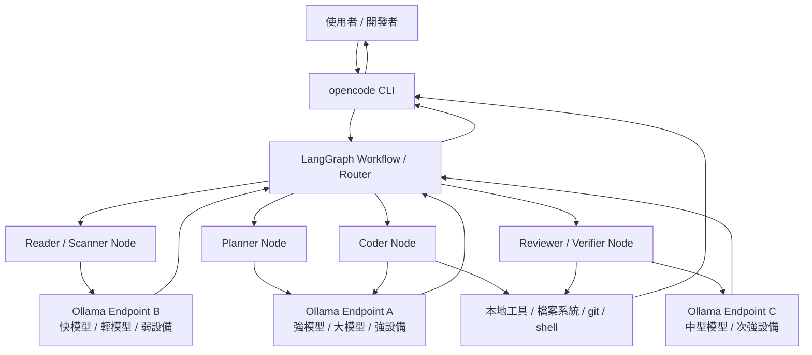

# opencode + LangGraph + Ollama 合作圖與筆記

更新日期：2026-04-02

## 一句話定位

- **opencode**：coding agent / CLI 執行者
- **LangGraph**：任務編排器 / router / workflow brain
- **Ollama**：模型 serving 層 / 本地模型入口

---

## 核心合作圖

---

## 角色邊界

## 1. opencode

### 主要角色
- 接收 CLI 指令
- 當 coding agent 執行具體工作
- 與本地 repo / 檔案系統 / shell 工具互動
- 把結果回傳給使用者

### 比較像什麼
- 前台 agent
- 實際幹活的人
- coding 任務的執行器

### 適合負責
- 讀寫檔案
- patch / refactor
- 執行測試
- shell 指令
- 把 LangGraph 的決策轉成實際操作

---

## 2. LangGraph

### 主要角色
- 判斷任務類型
- 拆解 task
- 管理 workflow 狀態
- 決定哪個子任務用哪個模型
- 決定哪些步驟串行、哪些步驟平行
- 必要時做 retry / branching / fallback

### 比較像什麼
- 總調度員
- 工作流引擎
- 大腦 / 指揮官

### 適合負責
- 任務分類（閱讀 / coding / 研究 / review）
- node 設計
- model routing
- 狀態保存
- 失敗恢復

---

## 3. Ollama

### 主要角色
- 提供本地模型 API
- 掛接不同模型與不同設備
- 給 LangGraph 的各個 node 呼叫

### 比較像什麼
- 模型機房
- serving layer
- 模型閘道後端

### 適合負責
- 快模型 serving
- coding 模型 serving
- 大模型 serving
- 分散在不同 GPU / 機器上的 endpoint

---

## 典型工作流

假設使用者下指令：

> 幫我分析 auth 模組、提出重構方案、然後改 code

### 可拆成這樣

#### Node 1：Reader / Scanner
- 掃描 repo
- 找 auth 相關檔案
- 產出初步摘要
- 使用快模型
- 可放在弱設備

#### Node 2：Planner
- 分析 auth 問題
- 提出重構計畫
- 使用強模型
- 放在強設備

#### Node 3：Coder
- 實際修改 code
- 執行 opencode 工具行為
- 使用 coding 主模型
- 放在強設備

#### Node 4：Reviewer / Verifier
- 檢查 patch
- 看是否破壞既有邏輯
- 建議補測試
- 可用中型或強模型

---

## 模型與設備分工範例

### 強設備（例如 2× Pro 6000 / 2× 5090）
- 主力 coding model
- planner / reasoning model
- 長上下文模型

### 中 / 弱設備（例如 RTX4000 SFF 40G）
- reader / summarizer model
- 輕量 review model
- embedding / rerank / indexing

---

## 關鍵原則

## 1. 不要讓 opencode 自己同時負責全部 orchestration
比較好的分工是：
- opencode 負責執行
- LangGraph 負責思考流程與模型分派

## 2. 不要期待 Ollama 自己會當大腦
Ollama 很適合 serving，
但 task decomposition / routing / state management 還是要放在 LangGraph 或上層自建邏輯。

## 3. 先把模型角色抽象化
不要一開始把 node 寫死成某個模型名稱，建議先抽象成：
- `fast_model`
- `coding_model`
- `reasoning_model`
- `review_model`

這樣未來可以自由切：
- 雲端模型
- 本地 Ollama
- 不同 GPU endpoint

## 4. 先驗證 workflow，再驗證本地硬體
先用雲端模型把 graph 跑通，再替換成本地 Ollama，通常最穩。

---

## 最小可行架構（MVP）

### 第一階段
- 使用者 → opencode
- opencode 呼叫 LangGraph
- LangGraph 只先切三種 task：
  - 閱讀
  - coding
  - review
- 模型先用雲端 LLM 代替本地模型

### 第二階段
- 把 LangGraph 的 node 改接 Ollama endpoint
- fast_model → 輕量本地模型
- coding_model → 主力本地 code 模型
- review_model → 中型本地模型

### 第三階段
- 不同 node 接到不同設備
- 加上 health check / queue / fallback
- 讓 workflow 更穩定

---

## 一句話總結

> `opencode` 負責當 coding agent 與工具執行者，`LangGraph` 負責拆解任務與安排模型使用，`Ollama` 負責提供分散在不同設備上的本地模型服務。

---

## 文件位置

`/home/node/.openclaw/workspace-roaringmoon/opencode-langgraph-ollama-合作圖與筆記.md`
